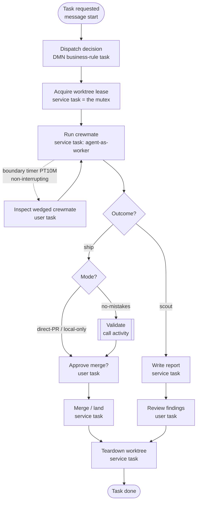

# ADR 0051 — Nano Workforce: a durable agent-crew orchestrator as an Urban app

Status: **Proposed.**
Date: 2026-07-31.

Relates to:
ADR 0046 (`0046-agent-as-worker-vs-agent-in-the-node.md`, **agent-as-worker** — a crewmate is exactly
this topology: an agent behind a `taskType`, activated by the engine),
ADR 0022 (`0022-nano-rad-application.md`, §E `workers[].taskType` — the runtime a crewmate worker
binds to),
ADR 0024 (`0024-urban-data-layer-datasource-abstraction.md`, the App-owned **datasource** — where the
claim/lease and task history live at rest),
ADR 0025 (`0025-urban-trigger-runtime.md`, the **inbound** edge — a source → durable inbox → engine;
Nano Workforce intake is a trigger),
ADR 0050 (`0050-urban-connectors-outbound-io-and-project-enablement.md`, connectors span both edges —
the crewmate worker and the GitHub/chat intake are connector packs),
ADR 0002 (`0002-leader-local-activation-and-lease-digest.md`) and ADR 0016
(`0016-falcon-protocol.md`) — the engine **job lease + deadline reclaim** that *is* the durable mutex,
replacing firstmate's `lsof`-based lock-staleness proof,
ADR 0040 (`0040-fused-domain-model.md`, the domain model the task's typed variables project into),
ADR 0028 (`0028-urban-app-user-auth-identity-authorization.md`, the captain/tenancy identity the app
threads),
ADR 0044/0045 (`0044-code-first-durable-orchestration.md`, `0045-code-first-workflows-rad-surface.md`,
the `@nanobpm/workflow` SDK a Workforce app can be authored in),
ADR 0048 (`0048-code-first-model-generation-with-di.md`, `workflow/src/layout.ts` `layoutBpmn` — used
to generate the diagram layout for [`docs/nano-workforce/crew-task.bpmn`](../nano-workforce/crew-task.bpmn)),
and the prior art it reframes: [`kunchenguid/firstmate`](https://github.com/kunchenguid/firstmate) (the
"agent distro" this ADR argues should be an engine-backed process), and this repo's own
`AGENTS.md` §"Claim Your Task Before You Start" (the GitHub-issue-comment advisory mutex Nano
Workforce replaces with a durable lease).

## Context

We just ran epic #406 (guided journeys) with **ten agents working in parallel worktrees**, coordinated
by hand: a claim mutex implemented as a `Claimed — worktree <name>` comment on the shared GitHub issue,
and one agent acting as coordinator. It worked, but the coordination was manual, advisory, and
un-durable — a claim can outlive its agent and deadlock a slice; nothing supervises a wedged worker;
recovery is a human reading `git worktree list`.

[**firstmate**](https://github.com/kunchenguid/firstmate) ("Talk to one agent. Ship with a crew.") is
the productized version of exactly this pattern. You chat with one **first mate**; it dispatches
autonomous **crewmates**, each in its own visible terminal and clean git **worktree**, supervises them
to completion, and hands back finished PRs, approved local merges, or investigation reports. You are
the **captain** and make only real decisions ("merge it").

firstmate is not a model, harness, MCP server, or CLI — it calls itself an **"agent distro"**: a cloned
repo of `AGENTS.md` + ~19 skills + **~105 bash scripts** + on-disk state conventions. Studying it
(`README.md`, `docs/architecture.md`, `AGENTS.md`), its load-bearing mechanisms are:

- **Single liaison.** A hard rule: the first mate never does project work itself; it only dispatches,
  supervises, and escalates. Crewmates never address the captain — all comms funnel through the mate.
- **Backlog = shared truth.** `data/backlog.md` (a `tasks-axi` markdown backend) holds the queue,
  dependencies, and history.
- **Claim/mutex via disk + locks.** Per-task `state/<id>.meta` + append-only `state/<id>.status`
  wake-events + real file locks, with a *provable-staleness* library (`fm-lock-lib.sh`): a lock is dead
  only if the file exists, **no live process holds it** (`lsof`), and it is older than a threshold —
  fail-safe, never reclaim on uncertainty.
- **Worktree isolation.** Crewmates never touch your checkout; `fm-spawn.sh` refuses to launch unless
  the path is a real git worktree root distinct from the primary checkout (pooled via `treehouse`).
- **Zero-token event-driven supervision.** A bash watcher (`fm-watch.sh`) *sleeps* on the fleet and
  wakes the LLM only when something is actionable (terminal status verb, wedged/stale pane, PR merged,
  external-wait timeout). Benign heartbeats are absorbed. Semantic "busy" is per-adapter and returns
  busy/idle/unknown/**dead** with its source; unknown is never promoted to idle. All of it is a durable
  `state/.wake-queue` so a missed process exit is recoverable across restarts.
- **Explicit modes & judgment seams.** Two task shapes (**ship** vs **scout**/report-only); three
  project modes (`no-mistakes` full-validation / `direct-PR` / `local-only`) + a `+yolo` autonomy flag;
  **dispatch profiles** where the LLM reads *natural-language* rules to pick harness/model/effort and
  shell only validates the shape; persistent **secondmates** (a crewmate with its own isolated home and
  a charter — "not a second architecture").

**The essential observation.** firstmate is a **durable state machine for agent work** — but
implemented as bash scripts polling markdown files and terminal panes, with the bulk of its ~105
scripts spent on liveness detection, lock-staleness proofs, wake de-duplication, and crash recovery.
**That is a workflow engine's job.** Every one of those mechanisms is something nano already owns as a
first-class, durable, replicated primitive:

| firstmate hand-rolls in bash | nano/Urban owns natively |
|---|---|
| `backlog.md` + `tasks-axi` + dependencies | a **BPMN process** with a durable instance per task; sequence flow *is* the dependency graph |
| `fm-watch.sh` polling + `.wake-queue` + crash recovery | the engine's durable **job queue**, **timers**, message correlation, at-least-once delivery, leader-local activation (ADR 0002) |
| `fm-lock-lib.sh` `lsof` lock-staleness | **job lease + deadline reclaim** (ADR 0002/0016), or a claim row in the **datasource** (ADR 0024) |
| `state/<id>.meta` / `.status` files | typed **process variables** + the **domain model** (ADR 0040) + the read-model/explorer |
| crewmate spawn in a tmux pane | a **service task** whose worker spawns/streams an agent — **agent-as-worker** (ADR 0046); intake/status via the command-stream client |
| "escalate only real decisions" | **user tasks** + **forms** (the captain's inbox = Tasklist) |
| `crew-dispatch.json` natural-language routing | a **DMN** decision table: shape × risk × quota → harness/model/effort/mode |
| watcher wake conditions | **connectors / I/O triggers** (ADR 0025/0050) — the Zapier-style inbound edge |
| `no-mistakes` validation pipeline | a **call activity** / subprocess with its own gateway |
| restart reconciliation | the engine is *already* a replicated durable log |

This is the Urban thesis (ADR 0024/0028/0040) in one artifact: **encapsulate the orchestration,
identity, state, and supervision wiring that a shell-and-filesystem distro leaves decomposed.**

## Decision

**Build Nano Workforce: an Urban application whose executable core is a BPMN process ("Crew Task"),
one durable instance per unit of agent work, running on the nano engine.** The captain talks to one
orchestrator surface; the *engine* — not a watcher script — owns durability, the claim mutex,
supervision timing, and crash recovery.

Nano Workforce is a **dogfooding** application first: its inaugural job is to run nano's own multi-agent
epics (the #406-style fan-out) end-to-end, retiring the manual issue-comment mutex. It is also the
reference proof that Urban can express a serious, stateful, human-in-the-loop automation entirely from
Urban primitives (process + DMN + forms + datasource + connectors + agent-workers).

### The Crew Task process

One instance per task. The sketch is [`docs/nano-workforce/crew-task.bpmn`](../nano-workforce/crew-task.bpmn)
(semantic source: [`crew-task.semantic.bpmn`](../nano-workforce/crew-task.semantic.bpmn); DI generated
by `layoutBpmn`, ADR 0048). Rendered as a flow:

Element-by-element mapping of the firstmate mechanism to the Urban primitive:

- **Intake → message start / connector.** A connector (GitHub issue labeled `agent`, a chat message, an
  `@mention`, a cron) starts an instance via the ADR 0025 inbound edge, with variables
  `{repo, request, shape, risk}`. This unifies firstmate's watcher wakes *and* X-mode mentions into one
  Urban trigger axis.
- **Dispatch → DMN business-rule task.** `workforce-dispatch` decides `{harness, model, effort, mode}`
  from shape × risk × quota. firstmate leaves this to LLM judgment over natural-language rules; Urban
  keeps the LLM to *summarize inputs* but makes the routing choice **deterministic and auditable** in
  DMN. (Flagship use case for the DMN work now in flight.)
- **Claim → service task = the durable mutex.** `workforce.claim` acquires a **worktree lease**: a row
  in the datasource (`task_id, worktree, agent, lease_expiry`) or, more natively, a held **job lease**.
  The engine's deadline-reclaim (ADR 0002/0016) *is* firstmate's provable-staleness lock — but durable,
  HA, and self-healing. A claim can no longer outlive its agent.
- **Run crewmate → service task (agent-as-worker, ADR 0046) + boundary timer.** `workforce.run-crewmate`
  is a job worker (Deno, per the Urban runtime) that leases a `treehouse` worktree, launches the agent
  harness, and streams `working/paused/blocked/done` back as variable updates / message events via the
  command-stream client. A **non-interrupting boundary timer** replaces `fm-watch.sh`: a heartbeat that
  does not renew within the wedge bound fires the timer → an escalation **user task**, with zero polling,
  no `.wake-queue`, and no hand-written crash recovery.
- **Outcome gateway → ship vs scout.** The two firstmate task shapes become a gateway: **ship** runs the
  validate/approve/land path; **scout** writes a standalone report and routes to human review.
- **Mode gateway → project modes.** `no-mistakes` gates a **Validate call activity** (a subprocess with
  its own pipeline); `direct-PR`/`local-only` skip straight to approval.
- **Approve merge → user task + form.** Encodes firstmate's hard rule "never merge without the captain's
  word." The captain's inbox is a Tasklist of user tasks; forms (the nano-ide form editor now being
  added) render the decision.
- **Teardown → service task, fail-closed.** `workforce.teardown` returns the worktree only after
  committed work is landed — firstmate's "never tear down unlanded work" hard rule.
- **Secondmates → call activity to a scoped sub-crew.** Not a second architecture: literally a
  subprocess with its own variable scope, exactly as firstmate frames it.

### What Nano Workforce needs from the nano-ide monorepo

All already on the roadmap; Workforce is the integrating use case that pulls them together:

1. **Forms** — intake + decision forms (the form editor being added).
2. **DMN** — the dispatch decision table (the DMN work in flight).
3. **Datasource** — claims/leases + task history (SQLite/Deno db manager).
4. **Connectors / I/O triggers** — GitHub/chat/cron intake and the crewmate worker (ADR 0050).
5. **A crewmate worker template** — a GUI/worker app (ADR 0009/0022) wrapping an agent harness +
   `treehouse` worktree + command-stream status streaming.
6. **Console surfaces** — the captain user-task inbox + the fleet view (the explorer already renders
   in-flight instances, giving firstmate's `fm-fleet-snapshot` for free).

### Scope of this ADR

This ADR **decides the framing and the process shape**; it does not yet specify the datasource schema,
the DMN table columns, the worker SDK surface, or the connector manifests. Those land in follow-up
increments once the intake→dispatch→claim→run→approve→land→teardown spine is proven on one repo.

## Consequences

- **The engine owns what firstmate hand-rolls.** Durability, the mutex, supervision timing, and crash
  recovery are engine primitives, not ~105 bash scripts. The code we write is business logic (workers,
  one DMN table, forms), not a re-implementation of a poll-based workflow engine on the filesystem.
- **Auditable, HA, restart-proof by construction.** A replicated durable log replaces
  `state/.wake-queue` reconciliation; a leased job replaces an advisory issue comment; a DMN table
  replaces natural-language routing an LLM re-interprets each time.
- **Dogfooding pressure on the whole Urban stack.** Workforce exercises forms, DMN, datasource,
  connectors, agent-as-worker, and the console together — surfacing integration gaps early, on our own
  multi-agent workflow, before external users hit them.
- **A concrete Urban flagship.** It is the "state-in-motion ↔ state-at-rest" story (ADR 0040) told as a
  shipping app: process variables (motion) + a claims/history datasource (rest), bridged by the domain
  model.
- **We give up firstmate's zero-install portability.** firstmate runs anywhere a terminal agent runs,
  with no engine. Nano Workforce requires a nano engine (embeddable — Bernd, ADR 0005 — but still a
  dependency). We accept this: the target user already runs nano, and durability is worth the engine.
- **New surface area to own.** Spawning and supervising real agent processes from a job worker is
  security- and resource-sensitive (sandboxing, quota, secret handling). The worker template must treat
  the agent as an untrusted child (ADR 0007 "declared data, no `eval`" posture).

## Open questions

- **Lease home: datasource row vs native job lease.** A job lease is the most native mutex and gets
  reclaim for free, but couples the claim's lifetime to a single job's activation. A datasource row is
  explicit and queryable (good for the fleet view) but re-introduces a staleness policy. Likely both: a
  job lease for liveness, a datasource row for the human-readable registry.
- **How much routing is DMN vs LLM?** firstmate deliberately leaves dispatch to LLM judgment. Where is
  the line between a deterministic DMN table (auditable) and an LLM service task (flexible)? Proposal:
  LLM classifies/normalizes inputs; DMN decides.
- **Crewmate transport.** Does the worker drive the agent via the existing command-stream clients
  (node-stream / nano-sdk-js), a harness-specific adapter (Claude/Codex/Grok, as firstmate does), or
  both behind one worker interface?
- **Human-in-the-loop latency vs autonomy.** firstmate's `+yolo` relaxes routine decisions. What is the
  Urban equivalent — a per-project variable that auto-completes the approve user task under a policy?
- **Supervision cadence primitive.** Is a single non-interrupting boundary timer enough, or do we need
  the richer firstmate escalation ladder (first stale surface → repeated escalation → demand-deep-
  inspection) modeled as an event subprocess with a counter?
- **Multi-tenant captains.** ADR 0028 identity: is a "captain" a user, a tenant, or a project role, and
  how does the datasource scope task history and claims per captain?
